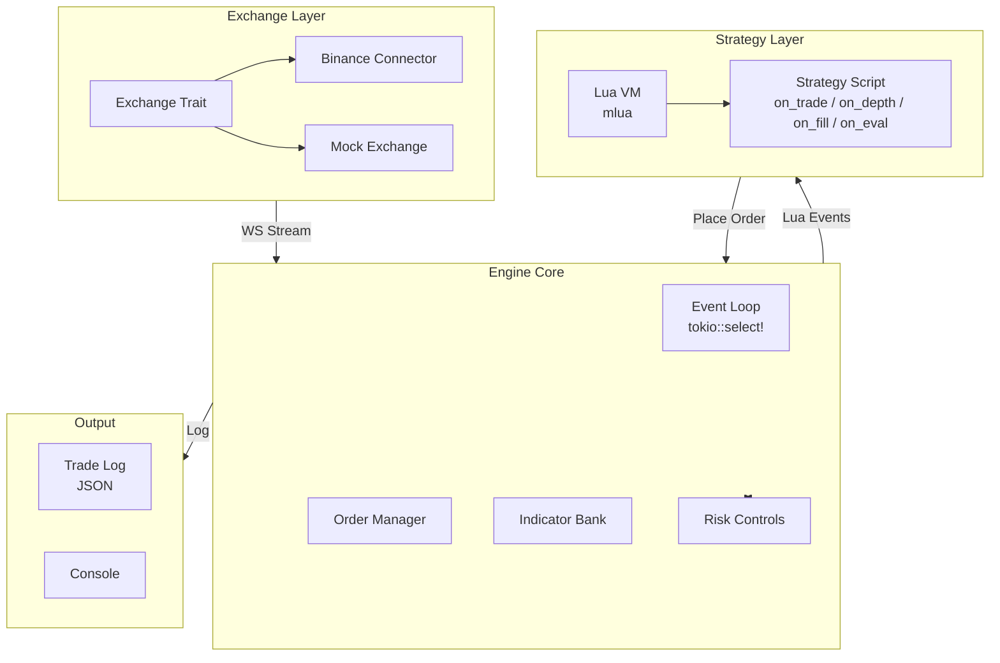
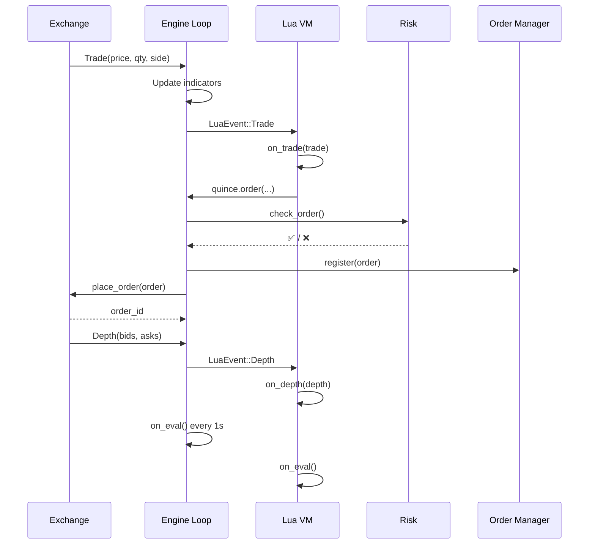
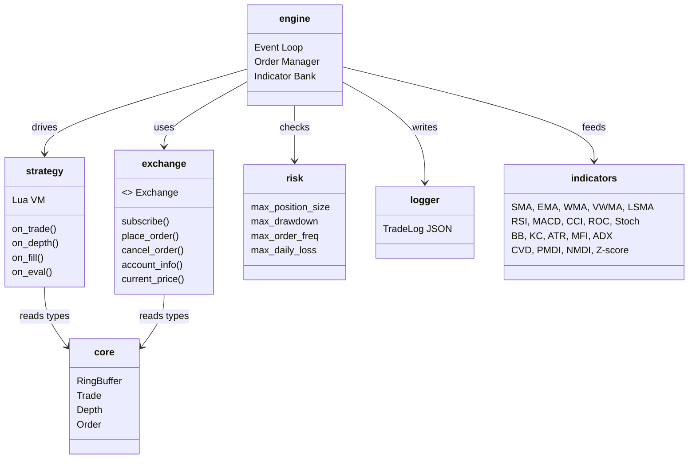

# Quince 🚧

[](https://github.com/0xitsss/quince)
[](https://github.com/0xitsss/quince)
[](https://github.com/0xitsss/quince)
[](https://www.gnu.org/licenses/gpl-3.0)

**Q**uantitative **U**ltra-low-latency **I**nterpreter for **N**etwork-centric **C**ompetitive **E**xecution

> **Work In Progress** — API unstable, sharp edges, may eat your portfolio.

HFT framework with LuaJIT strategy runtime. Reacts to every tick — no polling cycles.

---

## Architecture





## Crates



## Quick Start

```bash
# Mock mode (no API keys)
QUINCE_MOCK=1 cargo run

# With custom strategy & symbol
QUINCE_MOCK=1 QUINCE_STRATEGY=strategies/ema_cross.lua QUINCE_SYMBOL=btcusdt cargo run

# Live mode (Binance credentials required)
BINANCE_API_KEY=xxx BINANCE_SECRET_KEY=xxx cargo run
```

## Status

- ✅ Exchange trait + Binance connector (WS + REST)
- ✅ LuaJIT runtime with full API (place_order, balance, position, trades, depth, indicators)
- ✅ 20+ indicators (SMA, EMA, WMA, VWMA, LSMA, RSI, MACD, CCI, ROC, Stoch, BB, KC, ATR, MFI, ADX, CVD, PMDI, NMDI, Volume Delta, Z-score)
- ✅ Risk controls (position limit, drawdown, rate limit, daily loss, cooldown)
- ✅ Order manager (tracking, timeout, cancel)
- ✅ Mock mode for testing
- ✅ 126 tests passing

## License

GNU General Public License v3.0 — see [LICENSE](LICENSE) for details.
