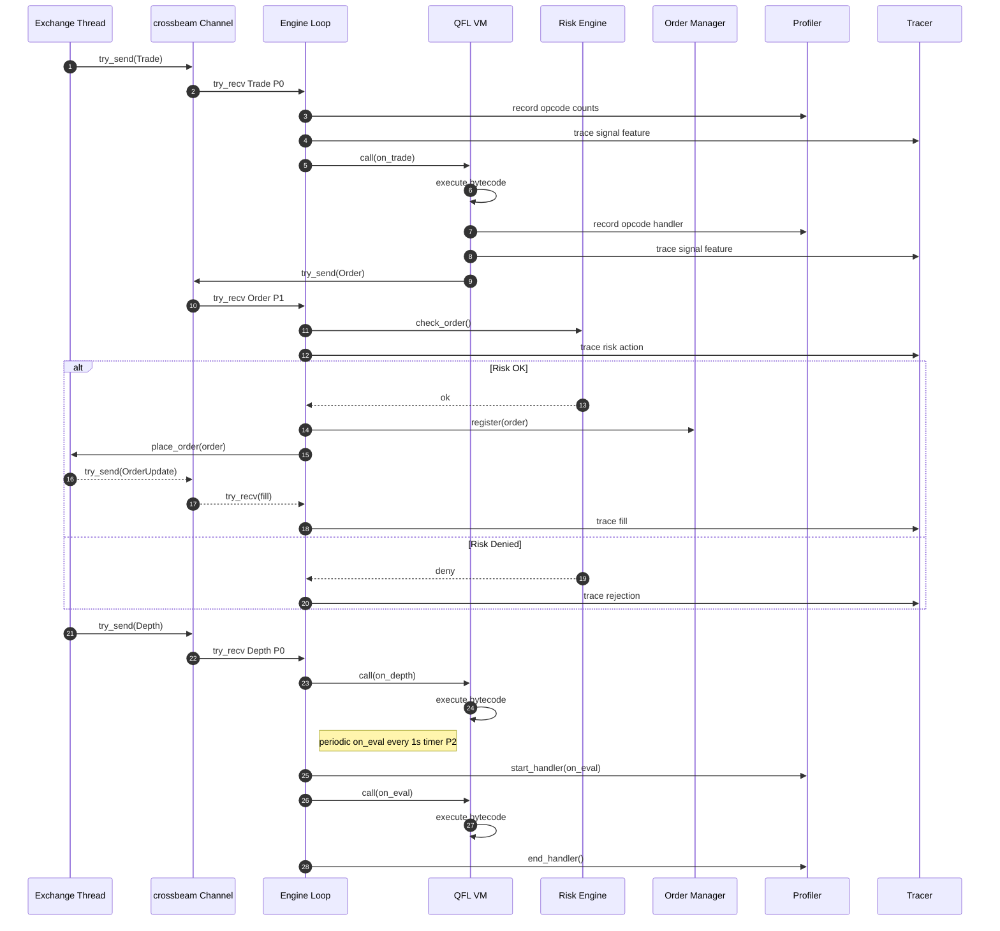
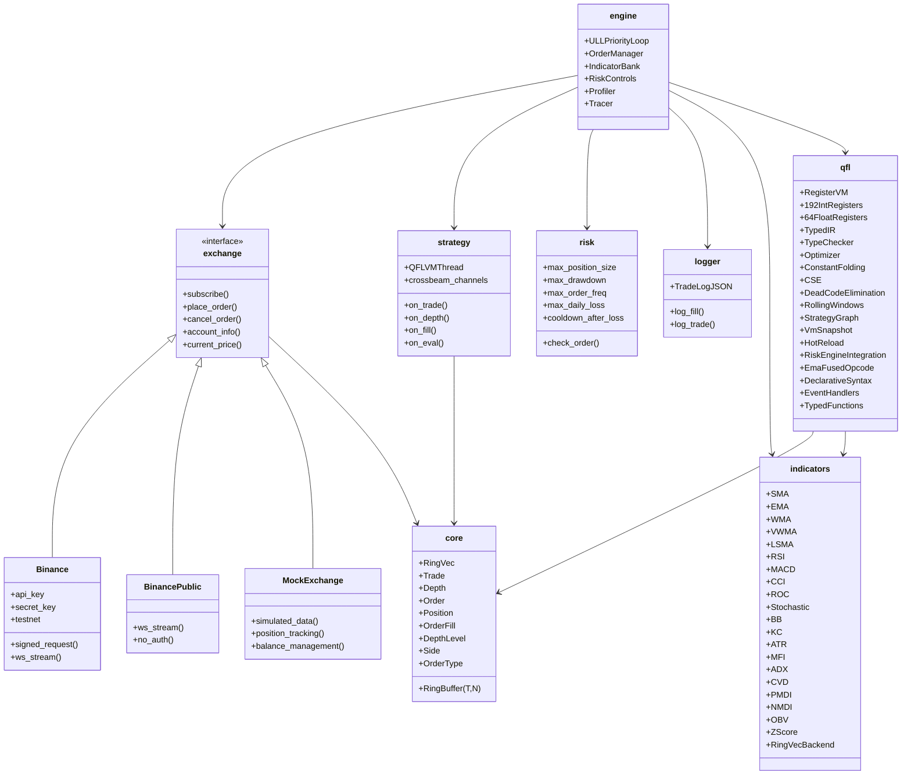
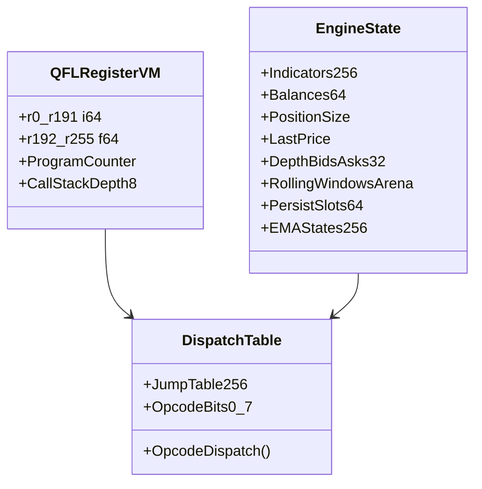
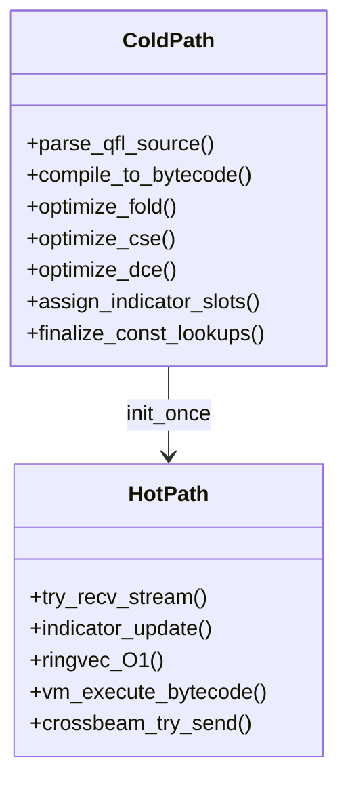

# Quince 🚧

[](https://github.com/0xitsss/quince)
[](https://github.com/0xitsss/quince)
[](https://github.com/0xitsss/quince)
[](https://www.gnu.org/licenses/agpl-3.0)
[](https://www.rust-lang.org)
[](https://github.com/0xitsss/quince/releases)
[](https://github.com/0xitsss/quince)

**Q**uantitative **U**ltra-low-latency **I**nterpreter for **N**etwork-centric **C**ompetitive **E**xecution

Low-latency trading engine using crossbeam channels throughout. No `tokio::sync::mpsc` or `tokio::sync::watch` — only `tokio::sync::oneshot` for request-response pairs. Engine loop uses ULL priority polling with `try_recv`.

---

# Architecture

```mermaid
classDiagram
    class ExchangeTrait {
        <<interface>>
        +subscribe() Result~Stream~
        +place_order() Result~String~
        +cancel_order() Result~void~
        +account_info() Result~AccountInfo~
        +current_price() Result~f64~
    }

    class Binance {
        +api_key
        +secret_key
        +testnet
        +signed_request()
        +ws_stream()
    }

    class BinancePublic {
        +ws_stream()
        +no_auth()
    }

    class MockExchange {
        +simulated_data()
        +position_tracking()
        +balance_management()
    }

    ExchangeTrait <|-- Binance
    ExchangeTrait <|-- BinancePublic
    ExchangeTrait <|-- MockExchange

    class EngineLoop {
        +ULLPriorityLoop
        +try_recv_priority_polling()
        +PriorityEval
        +PriorityStream
        +PriorityOrders
    }

    class OrderManager {
        +exchange_to_client O(1)
        +SLTPTracking
        +register()
        +fill_tracking()
    }

    class IndicatorBank {
        +20Indicators
        +RingVecBackend
        +slot_based_writes()
        +zero_alloc_hot_path()
    }

    class RiskControls {
        +max_position_size
        +max_drawdown
        +max_order_freq
        +max_daily_loss
        +cooldown_after_loss
        +check_order()
    }

    class Profiler {
        +opcode_counts
        +handler_timing
        +record_opcode()
        +start_handler()
        +end_handler()
    }

    class Tracer {
        +signal_events
        +feature_events
        +fill_events
        +risk_events
        +ring_buffer_trace()
    }

    class QFLVM {
        +192IntRegisters
        +64FloatRegisters
        +64PersistSlots
        +256EMASlots
        +TypedIR
        +TypeChecker
        +Optimizer
    }

    class StrategyHandlers {
        +on_trade()
        +on_depth()
        +on_fill()
        +on_eval()
    }

    class VmSnapshot {
        +full_state_capture()
        +restore()
    }

    class StrategyGraph {
        +window_detection()
        +signal_detection()
    }

    class RollingWindows {
        +mean()
        +variance()
        +stddev()
        +min()
        +max()
        +sum()
    }

    class TradeLog {
        +JSONLines
        +log_fill()
        +log_trade()
    }

    class Console {
        +structured_logs()
    }

    class PuffinProfiler {
        +http_29012
    }

    EngineLoop --> OrderManager
    EngineLoop --> IndicatorBank
    EngineLoop --> RiskControls
    EngineLoop --> Profiler
    EngineLoop --> Tracer

    QFLVM --> StrategyHandlers

    EngineLoop --> VmSnapshot
    EngineLoop --> StrategyGraph
    IndicatorBank --> RollingWindows

    EngineLoop --> TradeLog
    EngineLoop --> Console
    EngineLoop --> PuffinProfiler
```





---

# Crates



---

# VM Internals





---

# Quick Start

```bash
# Mock mode (simulated data, no API keys)
QUINCE_MOCK=1 cargo run

# Public WS mode (real Binance data, no API keys)
QUINCE_PUBLIC=1 cargo run

# With custom QFL strategy & symbol
QUINCE_MOCK=1 QUINCE_STRATEGY=strategies/scalper.qfl QUINCE_SYMBOL=btcusdt cargo run

# Testnet mode (Binance testnet credentials)
BINANCE_API_KEY=xxx BINANCE_SECRET_KEY=xxx QUINCE_TESTNET=1 cargo run

# Live mode (real Binance credentials)
BINANCE_API_KEY=xxx BINANCE_SECRET_KEY=xxx cargo run

# With profiling (http://127.0.0.1:29012)
cargo run --features profiling

# Run all tests
cargo test
```

---

# Status

## Core Infrastructure

* Exchange trait + Binance WS/REST connector
* BinancePublic public WS mode
* Binance FAPI signed requests
* MockExchange simulated data
* Auto-fallback public WS mode

## Engine

* ULL priority polling loop
* try_recv stream priority
* crossbeam only
* Order manager O(1)
* SL TP tracking
* Indicator bank
* zero alloc hot path
* Risk controls
* Walkforward validation

## QFL VM

* Register VM
* 192 int registers
* 64 float registers
* 64 persist slots
* 256 EMA slots
* Typed IR
* Type checker
* Constant folding
* CSE
* DCE
* Profiler
* Tracer
* Rolling Window Engine
* StrategyGraph
* VmSnapshot
* RiskEngine integration
* Ema fused opcode
* Declarative syntax
* State declarations
* Event handlers
* Typed functions

## Indicators

* SMA
* EMA
* WMA
* VWMA
* LSMA
* RSI
* MACD
* CCI
* ROC
* Stochastic
* Bollinger Bands
* Keltner Channel
* ATR
* MFI
* CVD
* PMDI
* NMDI
* OBV
* Accumulation Distribution
* Volume Delta
* ADX
* ZScore
* DOM Imbalance
* Net OI

## Data Structures

* RingVec
* RingBuffer
* DepthLevel Copy

## Strategy

* Dedicated std thread VM
* Strategy API
* stop_loss support
* take_profit support
* on_trade
* on_depth
* on_fill
* on_eval

## Profiling

* puffin profiler
* opcode counts
* handler timing
* tracing
* slot based writes

## Testing

* 988 unit tests
* 44 integration tests
* 0 build warnings
* Mock mode validation

---

# Version History

| Version | Phase | Changes                                                                                 |
| ------- | ----- | --------------------------------------------------------------------------------------- |
| v0.6.1  | 6b    | Compiler safety hardening (register overflow, Index/Table, name length, emit_at bounds), VM debug_asserts, fix Jz/Jnz fencepost errors |
| v0.6.0  | 6a    | handler_param field access, persist coalesce, window O(1) deque, Vm hot/cold reorder |
| v0.5.3  | 5c    | Mov elimination (reuse analysis) — skip redundant Mov on variable read                 |
| v0.5.2  | 5b    | run_bare specialization, sanitize_f removal, JMP-after-Ret, TraceVM, engine HashMap removal |
| v0.5.1  | 5a    | Engine hot path optimizations — zero HashMap lookups in on_trade, VM handler cache |
| v0.5.0  | 4i    | Optimization pipeline v2 — local shadowing, LICM, loop unroll, fused lowering, GVN |
| v0.4.0  | 4g+4h | Feature pipeline, state declarations, event handlers, typed functions, Ema fused opcode |
| v0.3.6  | 4e    | Tracing                                                                                 |
| v0.3.5  | 4d    | Profiler                                                                                |
| v0.3.4  | 4c    | CSE                                                                                     |
| v0.3.3  | 4b    | Dead Code Elimination                                                                   |
| v0.3.2  | 4a    | Constant folding                                                                        |
| v0.3.1  | 3     | Risk Engine                                                                             |
| v0.3.0  | 2     | StrategyGraph, Snapshot Restore                                                         |
| v0.2.2  | 1.x   | Rolling Window Engine                                                                   |
| v0.2.0  | 1     | Typed IR                                                                                |
| v0.1.1  | 0     | Crossbeam migration                                                                     |

---

# License

GNU Affero General Public License v3.0
