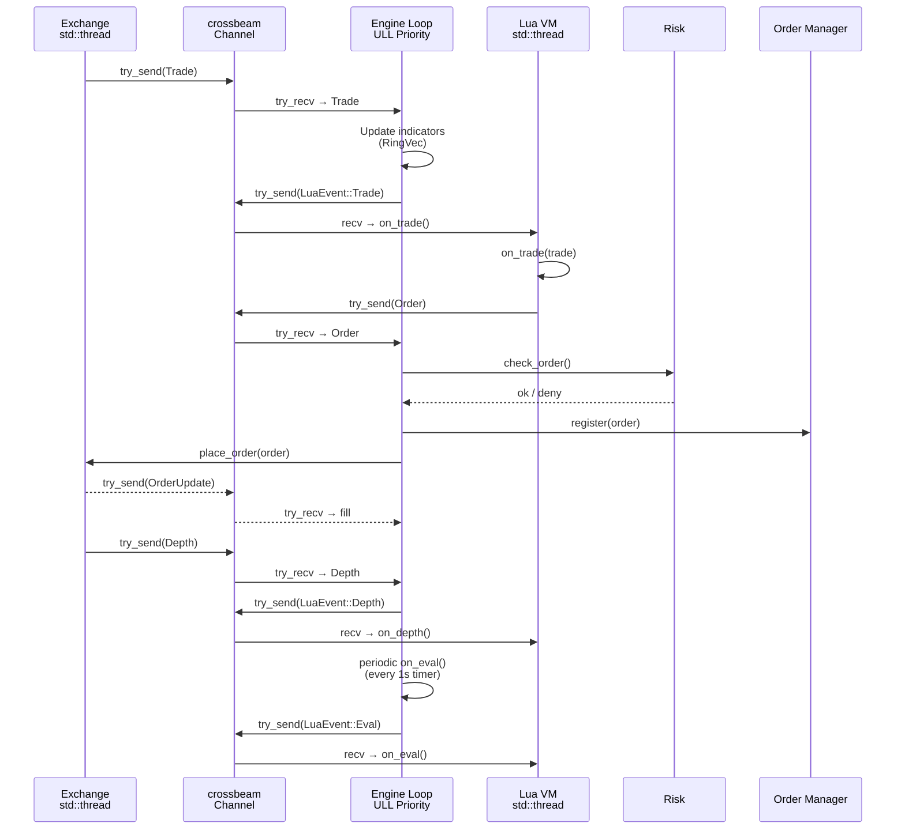
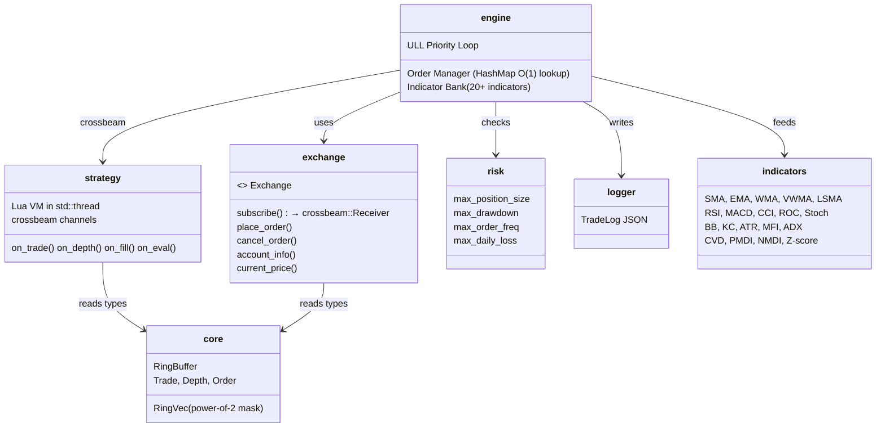

# Quince

[](https://github.com/0xitsss/quince)
[](https://github.com/0xitsss/quince)
[](https://www.gnu.org/licenses/gpl-3.0)

**Q**uantitative **U**ltra-low-latency **I**nterpreter for **N**etwork-centric **C**ompetitive **E**xecution

Low-latency trading engine using crossbeam channels throughout. No `tokio::sync::mpsc` or `tokio::sync::watch` — only `tokio::sync::oneshot` for request-response pairs. Engine loop uses ULL priority polling with `try_recv`.

---

## Architecture

```mermaid
graph TB
    subgraph Exchange["Exchange Layer"]
        T[Exchange Trait]
        B[Binance Connector<br/>crossbeam::Sender]
        M[Mock Exchange<br/>std::thread + crossbeam]
        P[BinancePublic<br/>Public WS Mode]
        T --> B
        T --> M
        T --> P
    end

    subgraph Engine["Engine Core"]
        EL[ULL Priority Loop<br/>try_recv: stream > orders > eval > acct]
        OM[Order Manager<br/>HashMap + exchange_to_client O(1)]
        IB[Indicator Bank<br/>RingVec-based 20+ indicators]
        RC[Risk Controls]
    end

    subgraph Strategy["Strategy Layer"]
        L[Lua VM<br/>mlua in std::thread]
        S[Strategy Script<br/>on_trade / on_depth / on_fill / on_eval]
        L --> S
    end

    subgraph Channel["Crossbeam Channels"]
        MD[Market Data<br/>bounded 1024]
        LE[Lua Events<br/>bounded 1024]
        OC[Orders<br/>crossbeam::Sender]
    end

    subgraph Output["Output"]
        TL[Trade Log<br/>JSON]
        CO[Console]
    end

    Exchange -->|try_send| MD
    MD --> EL
    EL -->|try_send| LE
    LE -->|recv| Strategy
    Strategy --> OC
    OC -->|try_recv| EL
    EL -->|Log| Output
    EL <--> RC
```



## Crates



## Quick Start

```bash
# Mock mode (simulated data, no API keys)
QUINCE_MOCK=1 cargo run

# Public WS mode (real Binance data, no API keys)
QUINCE_PUBLIC=1 cargo run

# With custom strategy & symbol
QUINCE_MOCK=1 QUINCE_STRATEGY=strategies/scalper.lua QUINCE_SYMBOL=btcusdt cargo run

# Testnet mode (Binance testnet credentials)
BINANCE_API_KEY=xxx BINANCE_SECRET_KEY=xxx QUINCE_TESTNET=1 cargo run

# Live mode (real Binance credentials)
BINANCE_API_KEY=xxx BINANCE_SECRET_KEY=xxx cargo run

# With profiling (http://127.0.0.1:29012)
cargo run --features profiling

# Run all tests
cargo test
```

## Status

### Core Infrastructure
- ✅ Exchange trait + Binance WS/REST connector (crossbeam channels)
- ✅ BinancePublic — public WS mode (no API keys needed)
- ✅ Binance FAPI — signed requests (API key + HMAC-SHA256)
- ✅ MockExchange — simulated data + position tracking + balance management
- ✅ Auto-fallback to public WS mode when no API keys set

### Engine
- ✅ ULL priority polling loop: `try_recv` stream > orders > eval > account sync
- ✅ All crossbeam channels (no `tokio::sync::mpsc` or `watch`)
- ✅ Order manager: HashMap O(1) exchange-to-client lookup, SL/TP tracking
- ✅ Indicator bank: 20+ indicators updated per-tick, zero String alloc in hot path
- ✅ Risk controls: position limit, drawdown, rate limit, daily loss, cooldown
- ✅ Purged CV-style walkforward validation support

### Indicators (VecDeque → RingVec)
- ✅ Trend: SMA, EMA, WMA, VWMA, LSMA
- ✅ Oscillators: RSI, MACD, CCI, ROC, Stochastic
- ✅ Volatility: Bollinger Bands, Keltner Channel, ATR
- ✅ Flow: MFI, CVD, PMDI, NMDI, OBV, Accumulation/Distribution, Volume Delta
- ✅ Structure: ADX, Z-Score, DOM Depth/Imbalance, Net OI
- ✅ All use `RingVec` — no `VecDeque`, no manual pop_front

### Data Structures
- ✅ `RingVec` — heap-allocated ring buffer, O(1) wrapping with branchless conditional subtract
- ✅ `RingBuffer<T,N>` — compile-time ring buffer with full test coverage
- ✅ `DepthLevel: Copy` — no unnecessary cloning

### Strategy
- ✅ Lua 5.4 runtime via mlua, runs in dedicated `std::thread`
- ✅ Strategy API: `quince.order()`, `quince.balance()`, `quince.position()`, `quince.trades()`, `quince.depth()`, `quince.get()`
- ✅ Stop-loss / take-profit via `quince.order({stop_loss=99, take_profit=101})`
- ✅ Events: `on_trade`, `on_depth`, `on_fill`, `on_eval`

### Profiling
- ✅ `puffin` profiler behind `profiling` feature flag
- ✅ Hot path optimized: indicators use `HashMap<&'static str, f64>` — zero alloc per tick

### Testing
- ✅ 191 tests across all crates
- ✅ 0 build warnings
- ✅ Mock mode tests with real position/balance tracking

## License

GNU General Public License v3.0 — see [LICENSE](LICENSE) for details.
