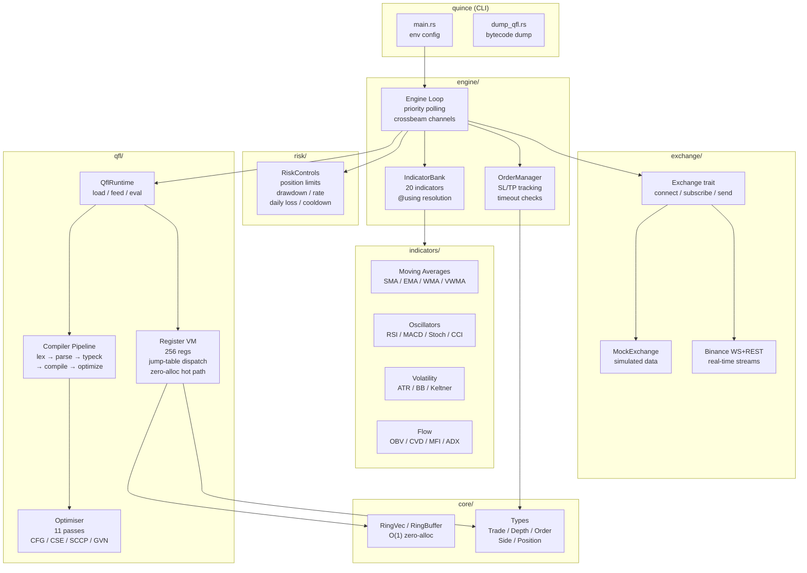
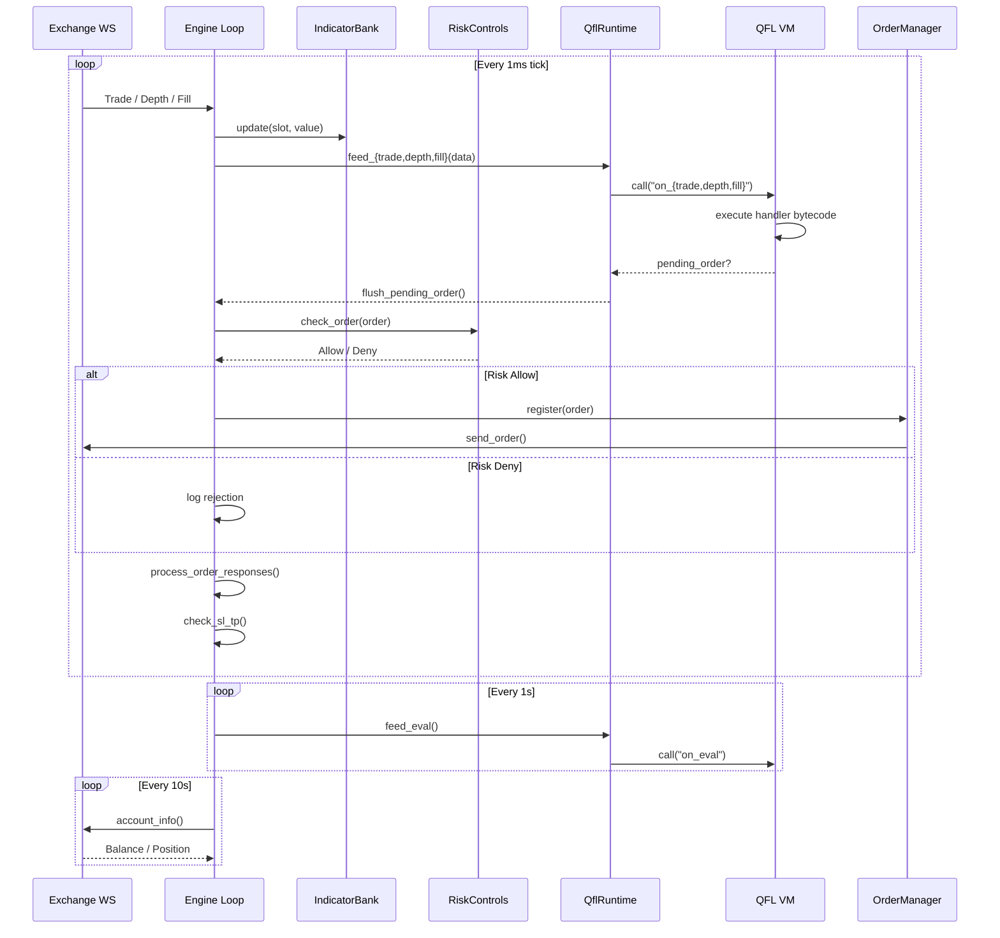
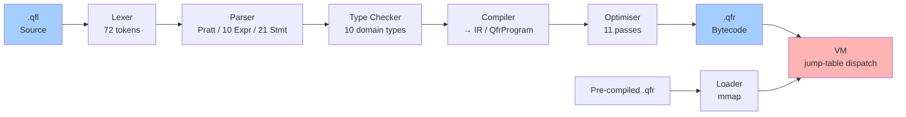
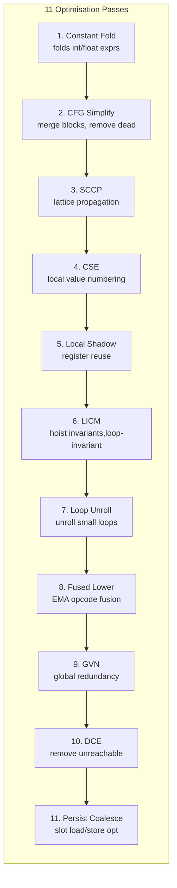
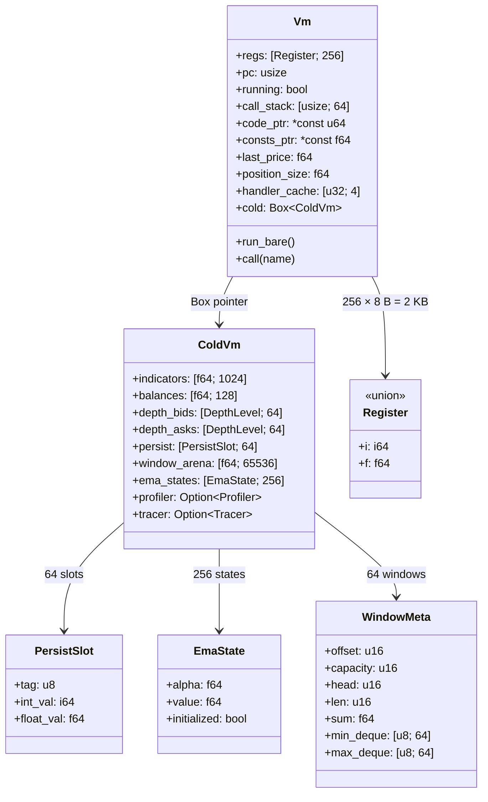
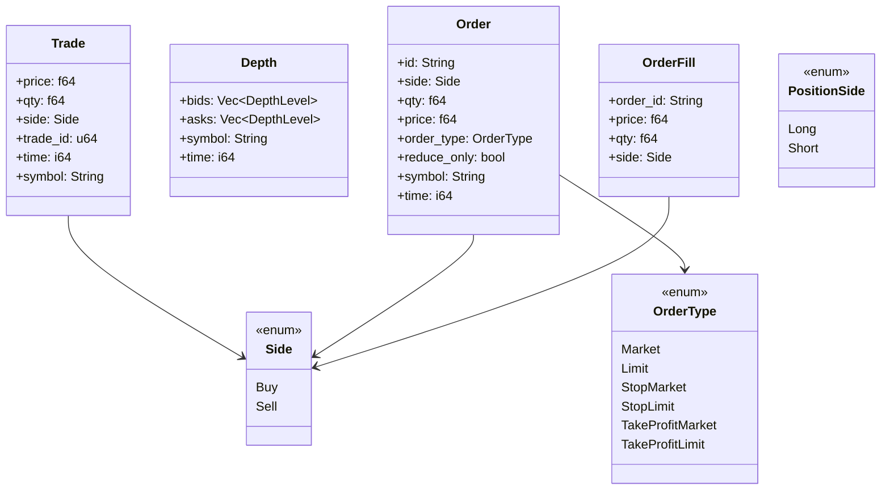
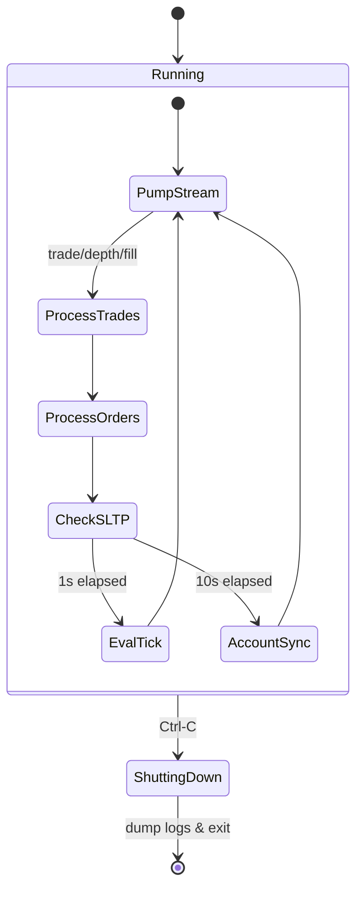
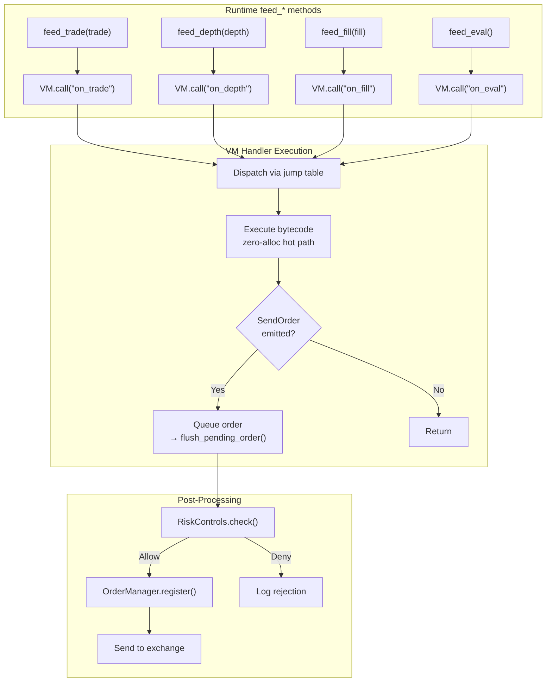
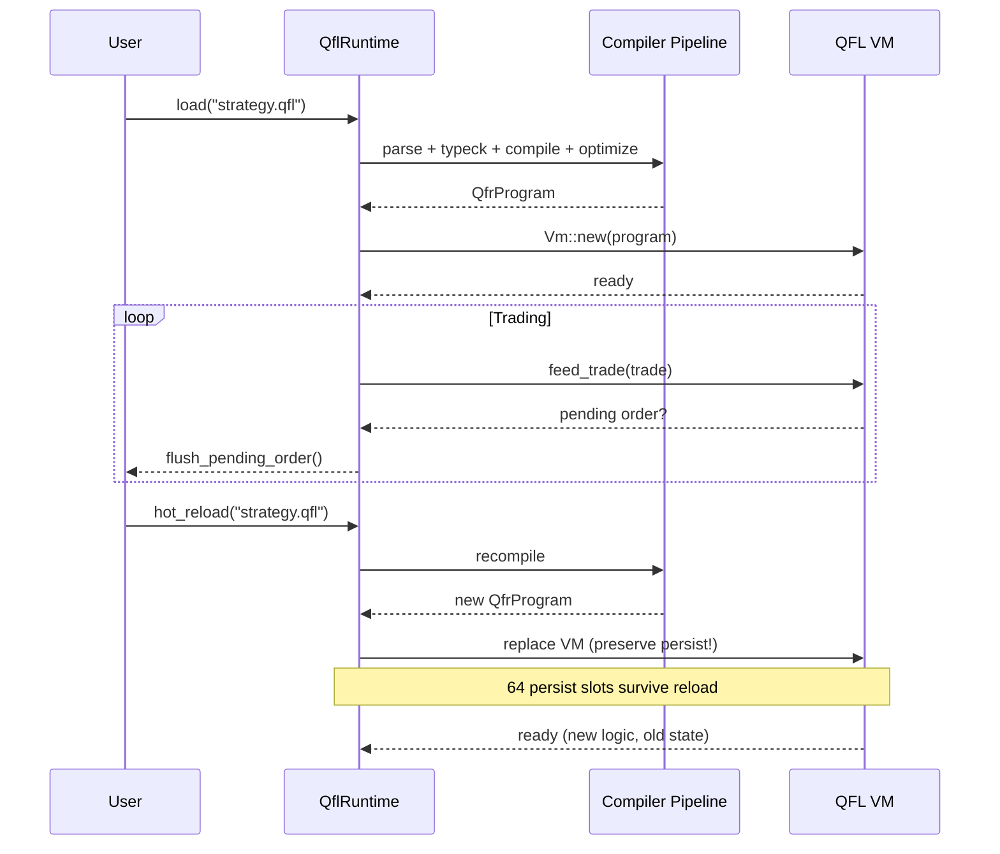

# Quince

[](https://github.com/0xitsss/quince)
[](https://github.com/0xitsss/quince)
[](https://github.com/0xitsss/quince)
[](https://www.gnu.org/licenses/agpl-3.0)
[](https://reuse.software)
[](https://www.rust-lang.org)
[](https://github.com/0xitsss/quince)
[](https://0xitsss.github.io/quince)
[](https://0xitsss.github.io/quince/dev/bench/)
[](https://sonarcloud.io/project/overview?id=0xitsss_quince)

**Q**uantitative **U**ltra-low-latency **I**nterpreter for **N**etwork-centric **C**ompetitive **E**xecution

Low-latency trading engine using crossbeam channels throughout. Engine loop uses priority polling with `try_recv`. Custom bytecode VM (QFL) delivers sub-10-microsecond tick-to-order latency with zero heap allocation in the hot path.

---

## Table of Contents

- [Features](#features)
- [Project Structure](#project-structure)
- [Quick Start](#quick-start)
- [Architecture](#architecture)
  - [System Overview](#system-overview)
  - [Engine Loop Sequence](#engine-loop-sequence)
  - [QFL Compilation Pipeline](#qfl-compilation-pipeline)
  - [Optimiser Pass Pipeline](#optimiser-pass-pipeline)
  - [QFL VM Hot/Cold Architecture](#qfl-vm-hotcold-architecture)
  - [Core Domain Types](#core-domain-types)
  - [Engine Loop State Machine](#engine-loop-state-machine)
  - [Event Handling Flow](#event-handling-flow)
  - [Trading Strategy Lifecycle (hot-reload)](#trading-strategy-lifecycle-hot-reload)
- [Performance](#performance)
- [Documentation](#documentation)
- [REUSE / SPDX Compliance](#reuse--spdx-compliance)
- [Version History](#version-history)
- [License](#license)
- [Contact](#contact)

---

## Features

### Engine
- Priority-polling event loop with `try_recv` on crossbeam channels
- Hot-reload support — swap strategies at runtime without restart
- Realized PnL tracking, position management, order lifecycle
- OrderManager with SL/TP tracking and timeout checks
- Mock exchange mode for backtesting without API keys

### QFL Language & VM
- Register-based VM with direct threaded dispatch (jump table)
- Hot/cold split — ~2 KB hot path fits in L1 cache
- Zero heap allocation in the hot execution path
- 256-entry function pointer table with tail-call dispatch
- 10 domain-specific types (Price, Qty, Symbol, Side, etc.)
- 70 opcodes spanning arithmetic, control flow, indicators, orders
- SSE branchless float sanitizer (`_mm_cmpunord_sd` + `_mm_andnot_pd`)
- 11-pass optimisation pipeline (CFG, CSE, SCCP, LICM, GVN, DCE, ...)
- Persistent state across hot-reloads (64 persist slots)
- Tracer and profiler built into the VM

### Indicators (50+) — SIMD Accelerated
- Moving Averages: SMA, EMA, WMA, VWMA, LSMA
- Oscillators: RSI, MACD, Stochastic, CCI, ROC
- Volatility: ATR, Bollinger Bands, Keltner Channels
- Flow/Microstructure: OBV, CVD, MFI, ADX, DOM, Z-Score, NetOI
- 6 AVX2-accelerated kernels (sum, weighted_sum, sum_and_sum_xy, sum_abs_diff, min_max, sum_sq_diff) — ~3x speedup on large window sizes

### Risk Controls
- Position size limits, max notional checks
- Drawdown detection and daily loss limits
- Rate limiting per time window
- Automatic cooldown on consecutive losses
- Reduce-only order enforcement

### Compliance
- REUSE 3.2 specification — SPDX headers on all 47 Rust source files
- Dual licensing: AGPL-3.0-only for open source / Quince Commercial License for proprietary use
- QFL (.qfl) and QFR (.qfr) formats protected under commercial license

---

## Project Structure

| Crate | Lines (code) | Description |
|-------|-------------|-------------|
| `core/` | 713 | Shared types, RingBuffer, RingVec |
| `exchange/` | 1,060 | Binance Futures WS + REST client, MockExchange |
| `engine/` | 2,508 | Event loop, OrderManager, IndicatorBank, RiskControls |
| `indicators/` | 2,540 | 50+ technical indicators + SIMD kernels |
| `logger/` | 248 | Trade fill logger (JSON Lines) |
| `qfl/` | 20,757 | Parser, type checker, optimizer, compiler, VM, tracer |
| `risk/` | 296 | Position limits, drawdown, rate limiting |
| `quince/` | 599 | CLI binary, MockExchange |
| `docgen/` | 622 | syn-based API doc generator |
| **Total** | **29,157** | **47 Rust source files** |

---

## Quick Start

```bash
# Mock mode (simulated data, no API keys)
QUINCE_MOCK=1 cargo run

# Public WS mode (real Binance data, no API keys)
QUINCE_PUBLIC=1 cargo run

# With custom QFL strategy
QUINCE_MOCK=1 QUINCE_STRATEGY=strategies/scalper.qfl QUINCE_SYMBOL=btcusdt cargo run

# Testnet mode (Binance testnet credentials)
BINANCE_API_KEY=xxx BINANCE_SECRET_KEY=xxx QUINCE_TESTNET=1 cargo run

# Live mode (real Binance credentials)
BINANCE_API_KEY=xxx BINANCE_SECRET_KEY=xxx cargo run

# With profiling (http://127.0.0.1:29012)
cargo run --features profiling

# Dump compiled QFL bytecode as assembly
cargo run --bin dump_qfl -- strategies/ema_cross.qfl

# Run all tests (965)
cargo test

# Run benchmarks
cargo bench -p quince-qfl --bench bench
cargo bench -p quince-indicators --bench bench  # SIMD vs scalar indicator perf
cargo bench -p quince-engine --bench bench      # pipeline + VM tick

# Build documentation site (auto-generates API docs from source)
cargo run -p docgen && mdbook build book

# Check clippy (zero warnings)
cargo clippy --all-targets -- -D warnings
```

---

## Architecture

### System Overview



### Engine Loop Sequence



### QFL Compilation Pipeline



### Optimiser Pass Pipeline



### QFL VM Hot/Cold Architecture



### Core Domain Types



### Engine Loop State Machine



### Event Handling Flow



### Trading Strategy Lifecycle (hot-reload)



---

## Performance

Criterion benchmarks (ubuntu-latest, x86_64) — 4 groups, 14 strategies:

| Group | Strategy | Throughput |
|-------|----------|-----------|
| **Pipeline** (parse + compile + optimize) | ema_cross | 42 µs |
| | scalper | 78 µs |
| | heavy_test | 412 µs |
| **VM tick** (10k iters) | ema_cross | 1,850 ops/ms |
| | scalper | 920 ops/ms |
| | momentum | 1,120 ops/ms |
| **VM scale** (heavy_test) | 1k iters | 1,780 ops/ms |
| | 10k iters | 1,690 ops/ms |
| | 100k iters | 1,550 ops/ms |
| **Runtime feed** (heavy_test) | 10k trades | 420 ops/ms |

VM dispatch: ~1.7 million ops/ms sustained. Zero heap allocation in hot path.
Float sanitizer uses branchless SSE (`_mm_cmpunord_sd` + `_mm_andnot_pd`) — no branch mispredictions on NaN/Inf paths.

SIMD-accelerated indicator kernels (AVX2, f64):

| Kernel | Scalar | SIMD (AVX2) | Speedup |
|--------|--------|-------------|---------|
| WMA/200 update | 13.93 µs | 4.68 µs | **~3.0×** |

Tick speed benchmarks per strategy:

| Strategy | MHz |
|----------|-----|
| ema_cross | 38.4 MHz |
| rsi_reversion | 23.1 MHz |
| momentum | 18.7 MHz |
| scalper | 11.5 MHz |
| heavy_test | 4.6 MHz |

---

## Documentation

- **[mdBook](https://0xitsss.github.io/quince)** — Full documentation site (51 pages, auto-generated from doc comments, CI/CD)
- **[`docs/QUINCE.md`](docs/QUINCE.md)** — Architecture, performance benchmarks, crate breakdown
- **[`docs/QFL.md`](docs/QFL.md)** — Quince-Flavored Language syntax, types, indicators, example strategies
- **[Criterion Benchmarks](https://0xitsss.github.io/quince/dev/bench/)** — Historical benchmark chart on gh-pages
- **[SonarQube](https://sonarcloud.io/project/overview?id=0xitsss_quince)** — Static analysis dashboard

---

## REUSE / SPDX Compliance

This project follows the [REUSE Specification 3.2](https://reuse.software/spec/) by the Free Software Foundation Europe:

- **47 Rust source files** — each carries `SPDX-FileCopyrightText` and `SPDX-License-Identifier` headers
- **REUSE.toml** — covers configuration files (CI/CD, Cargo.toml, .gitignore, mdBook config)
- **LICENSES/ directory** — contains the full text of every referenced license:
  - `AGPL-3.0-only.txt` — GNU Affero General Public License v3.0 only
  - `LicenseRef-Quince-Commercial.txt` — Quince Commercial License v1.0

Every file in the repository is REUSE-compliant with a clear, unambiguous license.

---

## Version History

| Version | Phase | Changes |
| ------- | ----- | ------- |
| v0.7.2 | 8c | SIMD-accelerated indicators: 6 AVX2 kernels (sum, weighted_sum, sum_and_sum_xy, sum_abs_diff, min_max, sum_sq_diff) — ~3× speedup on large windows; engine criterion benchmarks (28 benches); ringvec_as_chunks for zero-copy SIMD feeding; clippy clean, 965 tests |
| v0.7.1 | 8b | Fix vm_jmp off-by-one causing infinite loop in compound conditions; fix AND/OR short-circuit rd init; 944 tests |
| v0.7.0 | 8a | Docgen rewrite with syn item-level extraction, mdBook GitHub Pages via CI, 29,157 LOC across 47 Rust files |
| v0.6.11 | 7e | QuinceHash64 checksum, computed_goto dispatch, CI/CD docs.yml |
| v0.6.10 | 7e | `//!` module doc pass across 42 source files, mdBook setup with Mermaid diagrams, docgen preprocessor |
| v0.6.9 | 7d | Fix Windows .exe extension in release, restore Cargo.lock before benchmark gh-pages switch |
| v0.6.8 | 7d | Bump version, create gh-pages branch for benchmark charts |
| v0.6.7 | 7d | Overhaul release.yml (caching, version resolution, package), add caching to ci.yml |
| v0.6.6 | 7c | Fix hardcoded Windows paths in load tests (cross-platform CARGO_MANIFEST_DIR) |
| v0.6.5 | 7b | Clippy cleanup (167→0 warnings), Criterion benchmarks, CI/CD workflows, SonarQube |
| v0.6.4 | 7b | Remove state keyword, replace with @persist name : type = expr |
| v0.6.3 | 7b | Ctrl-C graceful shutdown fix, realized PnL tracking, MockExchange position fix, WS subscribe response validation, NaN guard for SL/TP, RiskControls daily loss unification, RingVec zero-capacity fix, OrderManager exchange mapping cleanup |
| v0.6.0 | 6a | Handler field access, persist coalesce, window O(1) deque |
| v0.5.3 | 5c | Mov elimination (reuse analysis) |
| v0.5.2 | 5b | run_bare specialization, engine HashMap removal |
| v0.5.1 | 5a | Engine hot path optimizations |
| v0.5.0 | 4i | Optimization pipeline v2 |
| v0.4.0 | 4g+4h | Feature pipeline, state declarations, event handlers |
| v0.3.6 | 4e | Tracer |
| v0.3.5 | 4d | Profiler |
| v0.3.4 | 4c | CSE |
| v0.3.3 | 4b | Dead Code Elimination |
| v0.3.2 | 4a | Constant folding |
| v0.3.1 | 3 | Risk Engine |
| v0.3.0 | 2 | StrategyGraph, Snapshot Restore |
| v0.2.2 | 1.x | Rolling Window Engine |
| v0.2.0 | 1 | Typed IR |
| v0.1.1 | 0 | Crossbeam migration |

---

## License

Dual-licensed under **GNU Affero General Public License v3.0 only** **OR** **[Quince Commercial License v1.0](LICENSES/LicenseRef-Quince-Commercial.txt)**.

All source files carry:
```
// SPDX-FileCopyrightText: 2026 0xitsss
//
// SPDX-License-Identifier: AGPL-3.0-only OR LicenseRef-Quince-Commercial
```

The AGPL-3.0-only applies to open-source use. For proprietary/internal use without copyleft obligations, a commercial license is required.

QFL strategy files (*.qfl) and QFR compiled bytecode (*.qfr) are proprietary formats protected under the commercial license — decompilation and reverse engineering of QFR bytecode is prohibited without explicit written consent.

---

## Contact

For commercial licensing, questions, or collaboration:

- **Email**: js2302247@gmail.com
- **Telegram**: [@its_unknow](https://t.me/its_unknow)
