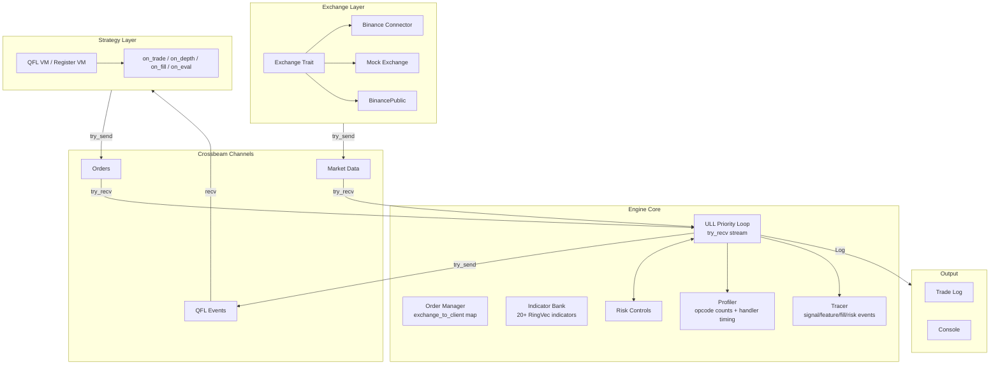
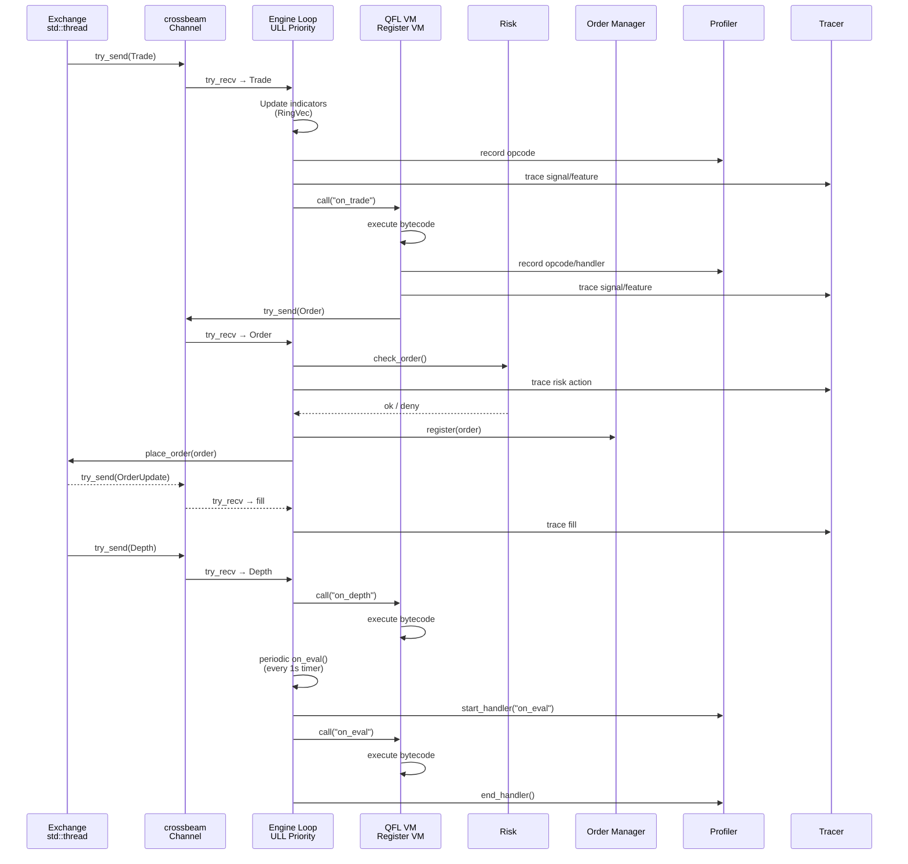
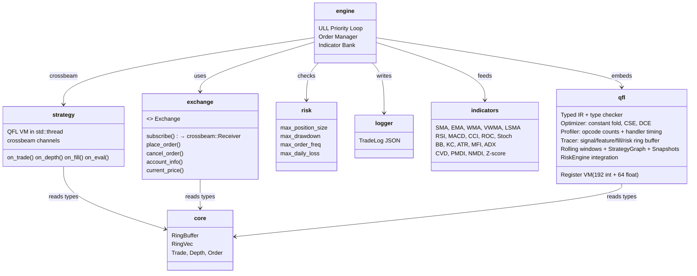

# Quince 🚧

[](https://github.com/0xitsss/quince)
[](https://github.com/0xitsss/quince)
[](https://github.com/0xitsss/quince)
[](https://www.gnu.org/licenses/agpl-3.0)

**Q**uantitative **U**ltra-low-latency **I**nterpreter for **N**etwork-centric **C**ompetitive **E**xecution

Low-latency trading engine using crossbeam channels throughout. No `tokio::sync::mpsc` or `tokio::sync::watch` — only `tokio::sync::oneshot` for request-response pairs. Engine loop uses ULL priority polling with `try_recv`.

---

## Architecture





---

## Crates



---

## Quick Start

```bash
# Mock mode (simulated data, no API keys)
QUINCE_MOCK=1 cargo run

# Public WS mode (real Binance data, no API keys)
QUINCE_PUBLIC=1 cargo run

# With custom QFL strategy & symbol
QUINCE_MOCK=1 QUINCE_STRATEGY=strategies/scalper.qfl QUINCE_SYMBOL=btcusdt cargo run

# Testnet mode (Binance testnet credentials)
BINANCE_API_KEY=xxx BINANCE_SECRET_KEY=xxx QUINCE_TESTNET=1 cargo run

# Live mode (real Binance credentials)
BINANCE_API_KEY=xxx BINANCE_SECRET_KEY=xxx cargo run

# With profiling (http://127.0.0.1:29012)
cargo run --features profiling

# Run all tests
cargo test
```

---

## Status

### Core Infrastructure
- ✅ Exchange trait + Binance WS/REST connector (crossbeam channels)
- ✅ BinancePublic — public WS mode (no API keys needed)
- ✅ Binance FAPI — signed requests (API key + HMAC-SHA256)
- ✅ MockExchange — simulated data + position tracking + balance management
- ✅ Auto-fallback to public WS mode when no API keys set

### Engine
- ✅ ULL priority polling loop: `try_recv` stream > orders > eval > account sync
- ✅ All crossbeam channels (no `tokio::sync::mpsc` or `watch`)
- ✅ Order manager: HashMap O(1) exchange-to-client lookup, SL/TP tracking
- ✅ Indicator bank: 20+ indicators updated per-tick, zero String alloc in hot path
- ✅ Risk controls: position limit, drawdown, rate limit, daily loss, cooldown
- ✅ Purged CV-style walkforward validation support

### QFL VM (quince-qfl crate)
- ✅ Register VM: 192 int + 64 float registers, 64 persist slots, 256 EmaState slots
- ✅ Typed IR + type checker (10 domain types: i64, f64, bool, timestamp, duration, price, qty, symbol, side, order_id)
- ✅ Optimization pipeline: constant folding → CSE → dead code elimination (71 tests)
- ✅ Profiler: opcode execution counts `[u64; 65]` + per-handler timing (12 tests)
- ✅ Tracer: signal/feature/fill/risk event ring buffer (29 tests)
- ✅ Rolling Window Engine — `RollingWindow` wrapping `RingVec` with online mean/variance/stddev/min/max/sum; 6 VM opcodes (22 tests)
- ✅ StrategyGraph — window/signal detection from bytecode (7 tests)
- ✅ VmSnapshot — full state capture + `restore()` for replay/hot-reload (5 tests)
- ✅ RiskEngine integration — risk-gated `flush_pending_order()` (6 tests)
- ✅ Ema fused opcode (opcode=64) — single-instruction EMA update with pre-allocated state (2 tests)
- ✅ Phase 4g: Declarative `@using name:param` / `@window capacity` / `feature` / `signal` syntax (13 tests)
- ✅ Phase 4h: `state name : type = default`, `on event(param?) { body }`, `fn name(params) -> type { body }` (11 tests)

### Indicators (VecDeque → RingVec)
- ✅ Trend: SMA, EMA, WMA, VWMA, LSMA
- ✅ Oscillators: RSI, MACD, CCI, ROC, Stochastic
- ✅ Volatility: Bollinger Bands, Keltner Channel, ATR
- ✅ Flow: MFI, CVD, PMDI, NMDI, OBV, Accumulation/Distribution, Volume Delta
- ✅ Structure: ADX, Z-Score, DOM Depth/Imbalance, Net OI
- ✅ All use `RingVec` — no `VecDeque`, no manual pop_front

### Data Structures
- ✅ `RingVec` — heap-allocated ring buffer, O(1) wrapping with branchless conditional subtract
- ✅ `RingBuffer<T,N>` — compile-time ring buffer with full test coverage
- ✅ `DepthLevel: Copy` — no unnecessary cloning

### Strategy
- ✅ QFL Register VM (192 int + 64 float regs), runs in dedicated `std::thread`
- ✅ Strategy API: `quince.order()`, `quince.balance()`, `quince.position()`, `quince.trades()`, `quince.depth()`, `quince.get()`
- ✅ Stop-loss / take-profit via `quince.order({stop_loss=99, take_profit=101})`
- ✅ Events: `on_trade`, `on_depth`, `on_fill`, `on_eval`

### Profiling & Observability
- ✅ `puffin` profiler behind `profiling` feature flag (http://127.0.0.1:29012)
- ✅ QFL Profiler: per-opcode counts `[u64; 65]` + per-handler timing (12 tests)
- ✅ QFL Tracer: signal/feature/fill/risk event ring buffer (29 tests)
- ✅ Hot path optimized: slot-based indicator writes (`set_indicator_by_slot`), no HashMap in tick (Phase 4g)

### Testing
- ✅ 695 tests passing in quince-qfl (16 pre-existing failures in lexer/parser/runtime unrelated to our changes)
- ✅ 28 integration tests in quince-engine (1 pre-existing failure: intg_fill_handler)
- ✅ 0 build warnings
- ✅ Mock mode tests with real position/balance tracking

---

## Version History

| Version | Phase | Changes |
|---------|-------|---------|
| v0.4.0 | 4g+4h | Feature pipeline (`@using name:param`, `@window`, `feature`, `signal`), State declarations (`state name : type`), Event handlers (`on event() { }`), Typed functions (`fn name() -> type { }`), Ema fused opcode, slot-based indicator writes |
| v0.3.6 | 4e | Tracing — signal/feature/fill/risk event ring buffer |
| v0.3.5 | 4d | Profiler — opcode counts + per-handler timing |
| v0.3.4 | 4c | CSE — Common Subexpression Elimination |
| v0.3.3 | 4b | Dead Code Elimination with jump offset adjustment |
| v0.3.2 | 4a | Constant folding optimization pass |
| v0.3.1 | 3 | Risk Engine, Event dispatch, risk-gated orders |
| v0.3.0 | 2 | Feature/Signal Graph, Snapshot/Restore, Replay |
| v0.2.2 | 1.x | Rolling Window Engine + VM opcodes |
| v0.2.0 | 1 | Typed IR, type checker, compile_checked |
| v0.1.1 | 0 | Crossbeam migration, RingVec, MockExchange |

---

## License

GNU Affero General Public License v3.0 — see [LICENSE](LICENSE) for details.