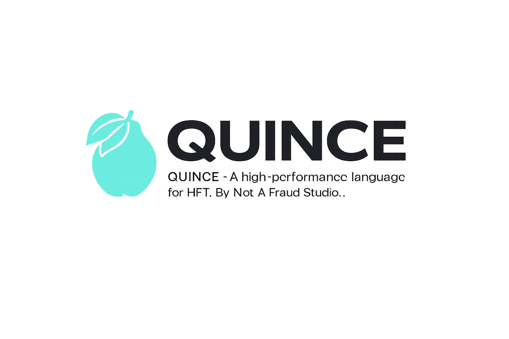
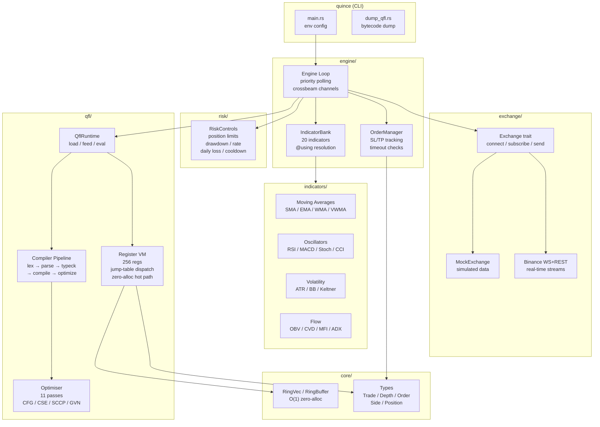
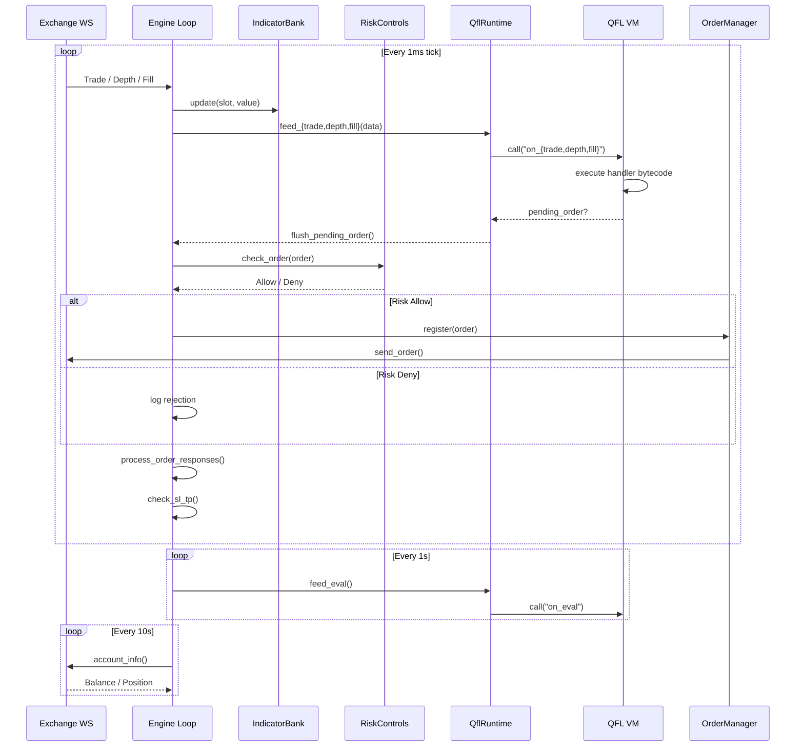
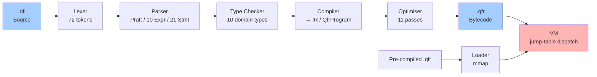
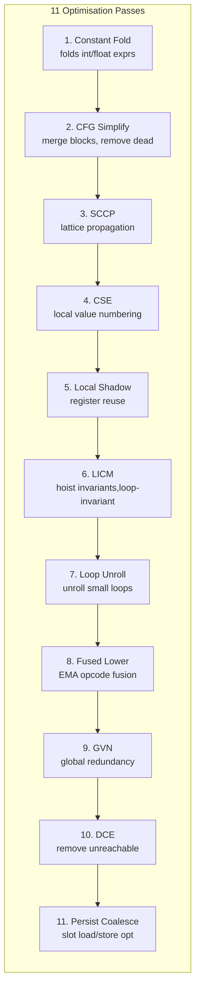
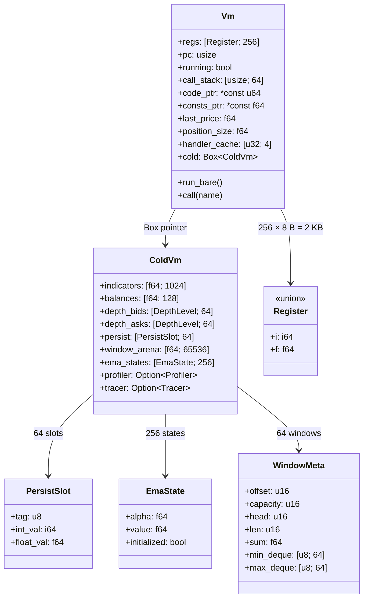
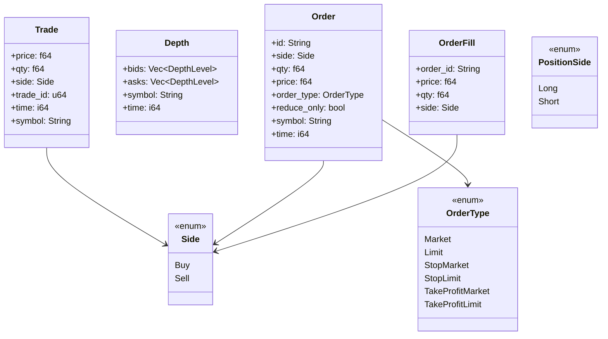
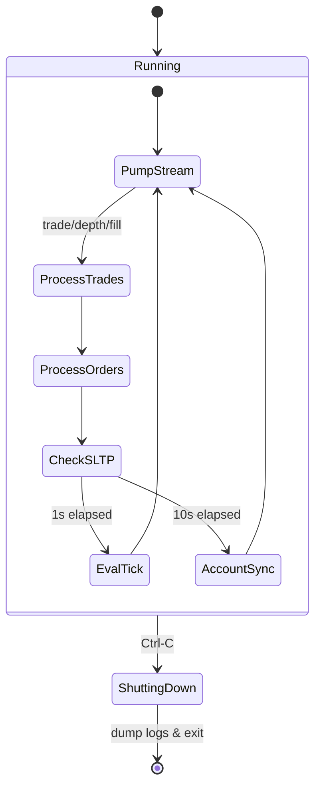
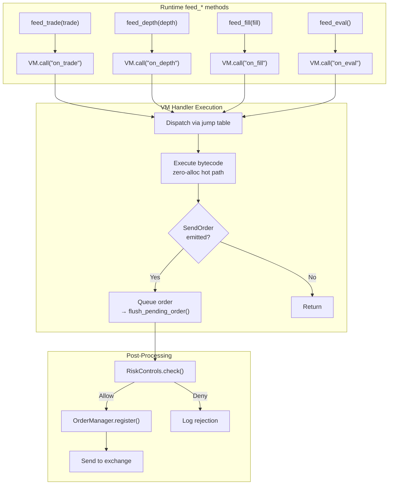
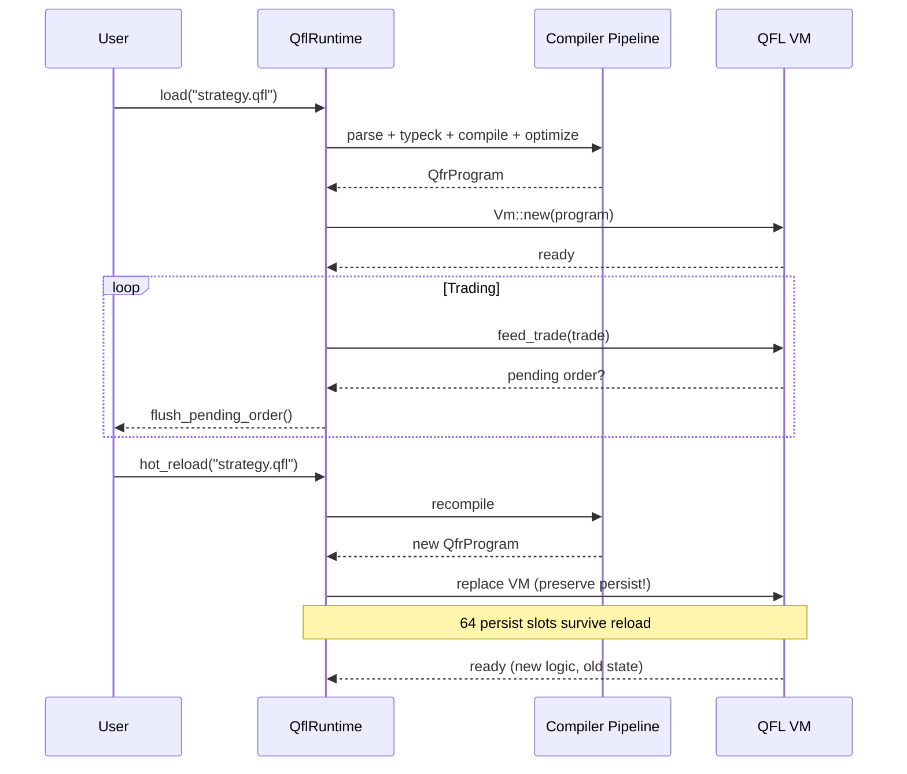

# Quince



[](https://github.com/0xitsss/quince)
[](https://github.com/0xitsss/quince/actions)
[](https://github.com/0xitsss/quince)
[](https://www.gnu.org/licenses/agpl-3.0)
[](https://reuse.software)
[](https://www.rust-lang.org)
[](https://github.com/0xitsss/quince)
[](https://0xitsss.github.io/quince)
[](https://sonarcloud.io/project/overview?id=0xitsss_quince)

**Q**uantitative **U**ltra-low-latency **I**nterpreter for **N**etwork-centric **C**ompetitive **E**xecution.

Quince is a Rust-native trading runtime for deterministic, event-driven
strategies. It combines a compiled QFL bytecode VM, bounded crossbeam-based
event flow, native indicator extensions, exchange adapters, replay, and
fail-closed execution controls in one deployable binary.

The project is built for operators who care about the whole path—not merely
strategy syntax: market-data integrity, order reconciliation, versioned
deployments, durable journals, risk latches, reproducible benchmarks, and a
clear boundary between public data, shadow mode, paper execution, and live
trading.

---

## Table of Contents

- [Capabilities](#capabilities)
- [Quick Start](#quick-start)
- [Project Structure](#project-structure)
- [Architecture](#architecture)
  - [System Overview](#system-overview)
  - [Engine Loop Sequence](#engine-loop-sequence)
  - [QFL Compilation Pipeline](#qfl-compilation-pipeline)
  - [Optimiser Pass Pipeline](#optimiser-pass-pipeline)
  - [QFL VM Hot/Cold Architecture](#qfl-vm-hotcold-architecture)
  - [Core Domain Types](#core-domain-types)
  - [Engine Loop State Machine](#engine-loop-state-machine)
  - [Event Handling Flow](#event-handling-flow)
  - [Trading Strategy Lifecycle (hot-reload)](#trading-strategy-lifecycle-hot-reload)
- [Performance](#performance)
- [Documentation](#documentation)
- [Production Beta](#production-beta)
- [REUSE / SPDX Compliance](#reuse--spdx-compliance)
- [Version History](#version-history)
- [License](#license)
- [Contact](#contact)

---

## Capabilities

### Engine
- Bounded, priority-polled event loop using non-blocking crossbeam channels
- Strategy lifecycle with content-addressed artifacts, version checks, shadow
  deployment, promotion, rollback, and durable checkpointing
- Order journal, reconciliation, idempotent client IDs, SL/TP lifecycle, and
  explicit ambiguous-submission handling
- Native Binance Futures and Hyperliquid paths with public-data modes,
  preflight validation, and execution that remains fail-closed by default
- Replay and paper execution with fees, slippage, deterministic event ordering,
  and capture import

### QFL Language & VM
- Register-based VM with direct threaded dispatch (jump table)
- Hot/cold split — ~2 KB hot path fits in L1 cache
- Zero heap allocation in the hot execution path
- 256-entry function pointer table with tail-call dispatch
- 10 domain-specific types (Price, Qty, Symbol, Side, etc.)
- 70 opcodes spanning arithmetic, control flow, indicators, orders
- SSE branchless float sanitizer (`_mm_cmpunord_sd` + `_mm_andnot_pd`)
- 11-pass optimisation pipeline (CFG, CSE, SCCP, LICM, GVN, DCE, ...)
- Persistent state across hot-reloads (64 persist slots)
- Tracer and profiler built into the VM

### Indicators
- Built-in technical indicators and **52 compiled native indicators** spanning
  trend, momentum, volatility, flow, and trade microstructure
- Native extension registry: every plugin declares its `@using` name, ordered
  parameter bounds, input/output contract, and factory at compile time
- No runtime plugin loading: indicators are reviewed, linked, tested, linted,
  and benchmarked as part of the deployed binary
- SIMD kernels for rolling computations where the architecture supports them
- Full reference: [native indicator catalogue](https://0xitsss.github.io/quince/native-indicators.html)

### Risk Controls
- Position size limits, max notional checks
- Drawdown detection, daily loss limits, and latched kill switches
- Rate limiting per time window
- Automatic cooldown on consecutive losses
- Reduce-only order enforcement and stale-data rejection

### Compliance
- REUSE 3.2 / SPDX licensing across source, strategies, documentation, CI, and
  manifests
- Dual licensing: AGPL-3.0-only for open source / Quince Commercial License for proprietary use
- QFL (.qfl) and QFR (.qfr) formats protected under commercial license

---

## Project Structure

| Area | Responsibility |
|---|---|
| `core/` | Shared domain types and bounded ring data structures. |
| `exchange/` | Binance and Hyperliquid adapters, signing, preflight, normalization, and public data feeds. |
| `engine/` | Event loop, strategy lifecycle, order journal, reconciliation, replay, risk integration, and telemetry. |
| `indicators/` | Built-ins, SIMD helpers, and the compile-time native-indicator registry. |
| `qfl/` | Lexer, parser, type checker, optimizer, compiler, register VM, tracer, and profiler. |
| `risk/` | Position, notional, rate, drawdown, cooldown, and execution-pause controls. |
| `quince/` | Operator CLI, wallet setup, replay/capture tools, and loopback-only dashboard. |
| `book/` | mdBook architecture guide, native indicator catalogue, and generated API reference. |

---

## Quick Start

Build with the pinned nightly toolchain and use mock mode first:

```bash
cargo +nightly build --locked
QUINCE_MOCK=1 cargo run --locked
```

Run a QFL strategy against the deterministic mock feed:

```bash
QUINCE_MOCK=1 \
  QUINCE_STRATEGY=strategies/scalper.qfl \
  QUINCE_SYMBOL=btcusdt \
  cargo run --locked
```

For public market-data observation, credentials are not required:

```bash
# Binance Futures public stream
QUINCE_PUBLIC=1 cargo run --locked

# Hyperliquid public stream; exchange/network are declared in the strategy
QUINCE_PUBLIC=1 \
  QUINCE_STRATEGY=strategies/hyperliquid_public.qfl \
  QUINCE_SYMBOL=BTC \
  cargo run --locked
```

### Wallet and execution

Create or import a dedicated Hyperliquid EVM wallet with hidden input:

```bash
QUINCE_WALLET_SETUP=1 cargo run --locked
```

The wizard stores the secret in `~/.config/quince/wallet.enc.json` (or
`$XDG_CONFIG_HOME/quince`) using AES-256-CBC with encrypt-then-MAC
authentication; the passphrase is never saved. The public address remains in
`wallet.json`. For a non-interactive authenticated process, provide
`QUINCE_WALLET_PASSPHRASE` through a secret manager. Never place a private key
or passphrase in QFL, `.env`, shell history, or a repository file. First
interactive launch opens this wizard automatically; use
`QUINCE_SKIP_WALLET_SETUP=1` only for an intentional wallet-free session.

Live execution is opt-in and requires exchange credentials. Start with the
relevant testnet/public/shadow workflow and verify reconciliation before
enabling it:

```bash
# Binance Futures testnet
BINANCE_API_KEY=... BINANCE_SECRET_KEY=... QUINCE_TESTNET=1 cargo run --locked

# Explicit Binance live mode
BINANCE_API_KEY=... BINANCE_SECRET_KEY=... QUINCE_LIVE=1 cargo run --locked
```

### Operator tools

```bash
# Loopback-only, read-only dashboard: http://127.0.0.1:3000
QUINCE_MOCK=1 QUINCE_DASHBOARD=1 cargo run --locked

# Journal inspection never opens an exchange socket
cargo run --locked --bin quince -- journal inspect trades.orders.jsonl
cargo run --locked --bin quince -- journal verify trades.orders.jsonl

# Inspect compiled QFL bytecode
cargo run --locked --bin dump_qfl -- strategies/custom_logistic_regression.qfl

# Replay every QFL strategy in a directory and write deterministic JSON + HTML.
# Fees, slippage, and starting equity are explicit research assumptions.
QUINCE_SYMBOL=BTCUSDT \
QUINCE_REPLAY_FEE_BPS=4 \
QUINCE_REPLAY_SLIPPAGE_BPS=2 \
QUINCE_REPLAY_INITIAL_EQUITY=10000 \
  cargo run --locked --bin quince -- research strategies captures/btcusdt.jsonl target/research/btcusdt
```

### Verification

```bash
cargo +nightly fmt --all -- --check
cargo test --workspace --lib --bins --tests --examples --locked
cargo clippy --workspace --all-targets --no-deps -- -D warnings
bash tools/verify_indicator_catalogue.sh

# Reproducible Criterion suites
cargo bench -p quince-qfl --bench bench -- --noplot
cargo bench -p quince-indicators --bench bench -- --noplot
cargo bench -p quince-engine --bench bench -- --noplot
```

The full operator and language reference is published in the
[mdBook](https://0xitsss.github.io/quince/).

## Production Beta

Quince's beta path is deliberately gated: offline preflight → public/shadow →
costed replay → Binance Futures testnet → tightly limited Binance live. The
dashboard is loopback-only and read-only; it is not a remote trading console.
Hyperliquid currently supports wallet onboarding and public data, while its
authenticated execution boundary remains fail-closed.

Use the [production beta runbook](https://0xitsss.github.io/quince/production-beta.html)
for exact commands, explicit small risk bounds, promotion criteria, and
emergency stop/reconciliation procedure. Never put credentials or wallet
secrets in a repository, QFL file, or shell history.

---

## Architecture

### System Overview


```mermaid
graph TB
    subgraph CLI["quince (CLI)"]
        Main["main.rs<br/>env config"]
        Dump["dump_qfl.rs<br/>bytecode dump"]
    end

    subgraph Exchange["exchange/"]
        Trait["Exchange trait<br/>connect / subscribe / send"]
        Binance["Binance WS+REST<br/>real-time streams"]
        Mock["MockExchange<br/>simulated data"]
    end

    subgraph Engine["engine/"]
        Loop["Engine Loop<br/>priority polling<br/>crossbeam channels"]
        OM["OrderManager<br/>SL/TP tracking<br/>timeout checks"]
        IB["IndicatorBank<br/>20 indicators<br/>@using resolution"]
    end

    subgraph Risk["risk/"]
        RC["RiskControls<br/>position limits<br/>drawdown / rate<br/>daily loss / cooldown"]
    end

    subgraph QFL["qfl/"]
        RT["QflRuntime<br/>load / feed / eval"]
        VM["Register VM<br/>256 regs<br/>jump-table dispatch<br/>zero-alloc hot path"]
        Compiler["Compiler Pipeline<br/>lex → parse → typeck<br/>→ compile → optimize"]
        Opt["Optimiser<br/>11 passes<br/>CFG / CSE / SCCP / GVN"]
    end

    subgraph Core["core/"]
        Types["Types<br/>Trade / Depth / Order<br/>Side / Position"]
        Ring["RingVec / RingBuffer<br/>O(1) zero-alloc"]
    end

    subgraph Indicators["indicators/"]
        MA["Moving Averages<br/>SMA / EMA / WMA / VWMA"]
        Osc["Oscillators<br/>RSI / MACD / Stoch / CCI"]
        Vol["Volatility<br/>ATR / BB / Keltner"]
        Flow["Flow<br/>OBV / CVD / MFI / ADX"]
    end

    Main --> Loop
    Loop --> Trait
    Trait --> Binance
    Trait --> Mock
    Loop --> OM
    Loop --> IB
    Loop --> RC
    Loop --> RT
    RT --> VM
    RT --> Compiler
    Compiler --> Opt
    IB --> Indicators
    OM --> Types
    VM --> Types
    VM --> Ring
```

### Engine Loop Sequence


```mermaid
sequenceDiagram
    participant Exchange as Exchange WS
    participant Engine as Engine Loop
    participant IB as IndicatorBank
    participant Risk as RiskControls
    participant RT as QflRuntime
    participant VM as QFL VM
    participant OM as OrderManager

    loop Every 1ms tick
        Exchange->>Engine: Trade / Depth / Fill
        Engine->>IB: update(slot, value)
        Engine->>RT: feed_{trade,depth,fill}(data)

        RT->>VM: call("on_{trade,depth,fill}")
        VM->>VM: execute handler bytecode
        VM-->>RT: pending_order?
        RT-->>Engine: flush_pending_order()

        Engine->>Risk: check_order(order)
        Risk-->>Engine: Allow / Deny

        alt Risk Allow
            Engine->>OM: register(order)
            OM->>Exchange: send_order()
        else Risk Deny
            Engine->>Engine: log rejection
        end

        Engine->>Engine: process_order_responses()
        Engine->>Engine: check_sl_tp()
    end

    loop Every 1s
        Engine->>RT: feed_eval()
        RT->>VM: call("on_eval")
    end

    loop Every 10s
        Engine->>Exchange: account_info()
        Exchange-->>Engine: Balance / Position
    end
```

### QFL Compilation Pipeline


```mermaid
flowchart LR
    S[".qfl<br/>Source"] --> L["Lexer<br/>72 tokens"]
    L --> P["Parser<br/>Pratt / 10 Expr / 21 Stmt"]
    P --> TC["Type Checker<br/>10 domain types"]
    TC --> C["Compiler<br/>→ IR / QfrProgram"]
    C --> O["Optimiser<br/>11 passes"]
    O --> B[".qfr<br/>Bytecode"]
    B --> V["VM<br/>jump-table dispatch"]

    QFR["Pre-compiled .qfr"] --> LD["Loader<br/>mmap"]
    LD --> V

    style S fill:#4a9eff80
    style B fill:#4a9eff80
    style V fill:#ff6b6b80
```

### Optimiser Pass Pipeline


```mermaid
flowchart TB
    subgraph Pipeline["11 Optimisation Passes"]
        direction TB
        CF["1. Constant Fold<br/>folds int/float exprs"]
        CFG["2. CFG Simplify<br/>merge blocks, remove dead"]
        SCCP["3. SCCP<br/>lattice propagation"]
        CSE["4. CSE<br/>local value numbering"]
        LS["5. Local Shadow<br/>register reuse"]
        LICM["6. LICM<br/>hoist invariants,loop-invariant"]
        LU["7. Loop Unroll<br/>unroll small loops"]
        FL["8. Fused Lower<br/>EMA opcode fusion"]
        GVN["9. GVN<br/>global redundancy"]
        DCE["10. DCE<br/>remove unreachable"]
        PC["11. Persist Coalesce<br/>slot load/store opt"]
    end

    CF --> CFG --> SCCP --> CSE --> LS --> LICM --> LU --> FL --> GVN --> DCE --> PC
```

### QFL VM Hot/Cold Architecture


```mermaid
classDiagram
    class Vm {
        +regs: [Register; 256]
        +pc: usize
        +running: bool
        +call_stack: [usize; 64]
        +code_ptr: *const u64
        +consts_ptr: *const f64
        +last_price: f64
        +position_size: f64
        +handler_cache: [u32; 4]
        +cold: Box~ColdVm~
        +run_bare()
        +call(name)
    }

    class ColdVm {
        +indicators: [f64; 1024]
        +balances: [f64; 128]
        +depth_bids: [DepthLevel; 64]
        +depth_asks: [DepthLevel; 64]
        +persist: [PersistSlot; 64]
        +window_arena: [f64; 65536]
        +ema_states: [EmaState; 256]
        +profiler: Option~Profiler~
        +tracer: Option~Tracer~
    }

    class Register {
        <<union>>
        +i: i64
        +f: f64
    }

    class PersistSlot {
        +tag: u8
        +int_val: i64
        +float_val: f64
    }

    class EmaState {
        +alpha: f64
        +value: f64
        +initialized: bool
    }

    class WindowMeta {
        +offset: u16
        +capacity: u16
        +head: u16
        +len: u16
        +sum: f64
        +min_deque: [u8; 64]
        +max_deque: [u8; 64]
    }

    Vm --> ColdVm : Box pointer
    Vm --> Register : 256 × 8 B = 2 KB
    ColdVm --> PersistSlot : 64 slots
    ColdVm --> EmaState : 256 states
    ColdVm --> WindowMeta : 64 windows
```

### Core Domain Types


```mermaid
classDiagram
    class Trade {
        +price: f64
        +qty: f64
        +side: Side
        +trade_id: u64
        +time: i64
        +symbol: String
    }

    class Depth {
        +bids: Vec~DepthLevel~
        +asks: Vec~DepthLevel~
        +symbol: String
        +time: i64
    }

    class Order {
        +id: String
        +side: Side
        +qty: f64
        +price: f64
        +order_type: OrderType
        +reduce_only: bool
        +symbol: String
        +time: i64
    }

    class OrderFill {
        +order_id: String
        +price: f64
        +qty: f64
        +side: Side
    }

    class OrderType {
        <<enum>>
        Market
        Limit
        StopMarket
        StopLimit
        TakeProfitMarket
        TakeProfitLimit
    }

    class Side {
        <<enum>>
        Buy
        Sell
    }

    class PositionSide {
        <<enum>>
        Long
        Short
    }

    Trade --> Side
    Order --> Side
    Order --> OrderType
    OrderFill --> Side
```

### Engine Loop State Machine


```mermaid
stateDiagram-v2
    [*] --> Running

    state Running {
        [*] --> PumpStream
        PumpStream --> ProcessTrades : trade/depth/fill
        ProcessTrades --> ProcessOrders
        ProcessOrders --> CheckSLTP
        CheckSLTP --> EvalTick : 1s elapsed
        CheckSLTP --> AccountSync : 10s elapsed
        EvalTick --> PumpStream
        AccountSync --> PumpStream
    }

    Running --> ShuttingDown : Ctrl-C
    ShuttingDown --> [*] : dump logs & exit
```

### Event Handling Flow


```mermaid
flowchart TB
    subgraph Feed["Runtime feed_* methods"]
        T["feed_trade(trade)"] --> VT["VM.call(&quot;on_trade&quot;)"]
        D["feed_depth(depth)"] --> VD["VM.call(&quot;on_depth&quot;)"]
        F["feed_fill(fill)"] --> VF["VM.call(&quot;on_fill&quot;)"]
        E["feed_eval()"] --> VE["VM.call(&quot;on_eval&quot;)"]
    end

    subgraph VMExecute["VM Handler Execution"]
        VT --> D1["Dispatch via jump table"]
        VD --> D1
        VF --> D1
        VE --> D1
        D1 --> H["Execute bytecode<br/>zero-alloc hot path"]
        H --> O{"SendOrder<br/>emitted?"}
        O -->|Yes| Q["Queue order<br/>→ flush_pending_order()"]
        O -->|No| R["Return"]
    end

    subgraph Post["Post-Processing"]
        Q --> RC["RiskControls.check()"]
        RC -->|Allow| OM["OrderManager.register()"]
        RC -->|Deny| RJ["Log rejection"]
        OM --> S["Send to exchange"]
    end
```

### Trading Strategy Lifecycle (hot-reload)


```mermaid
sequenceDiagram
    participant User
    participant RT as QflRuntime
    participant Compiler as Compiler Pipeline
    participant VM as QFL VM

    User->>RT: load("strategy.qfl")
    RT->>Compiler: parse + typeck + compile + optimize
    Compiler-->>RT: QfrProgram
    RT->>VM: Vm::new(program)
    VM-->>RT: ready

    loop Trading
        RT->>VM: feed_trade(trade)
        VM-->>RT: pending order?
        RT-->>User: flush_pending_order()
    end

    User->>RT: hot_reload("strategy.qfl")
    RT->>Compiler: recompile
    Compiler-->>RT: new QfrProgram
    RT->>VM: replace VM (preserve persist!)
    Note over RT,VM: 64 persist slots survive reload
    VM-->>RT: ready (new logic, old state)
```

---

## Performance

Performance is measured with Criterion and gated in CI against a versioned
baseline. Measurements are machine- and workload-specific; compare revisions
on the same runner rather than treating a single number as a latency guarantee.

Recent local release-profile measurements on 10,000 public-trade events:

| Workload | Time | Throughput |
|---|---:|---:|
| `custom_signed_volume`, indicator only | ~73 µs | ~136M events/s |
| `custom_signed_volume`, complete QFL pipeline | ~390 µs | ~25.6M events/s |
| `custom_logistic_regression`, indicator only | ~207 µs | ~48.3M events/s |
| `custom_logistic_regression`, complete QFL pipeline | ~708 µs | ~14.1M events/s |

The complete pipeline includes indicator update, feature-slot write, and
`on_trade` bytecode dispatch. Run the Criterion commands in
[Verification](#verification) before accepting a performance change. SIMD
rolling kernels are used where the CPU and workload permit them.

---

## Documentation

- **[mdBook](https://0xitsss.github.io/quince)** — architecture, operator model,
  QFL, native indicator catalogue, and generated API reference
- **[Native indicator catalogue](https://0xitsss.github.io/quince/native-indicators.html)** — all compiled plugins, their parameters, and intended signals
- **[`docs/QUINCE.md`](docs/QUINCE.md)** — architecture and crate breakdown
- **[`docs/QFL.md`](docs/QFL.md)** — QFL syntax, types, indicators, and example strategies
- **Operator dashboard** — `QUINCE_DASHBOARD=1` starts loopback-only Axum UI; it reads the durable journal via a bounded crossbeam bridge and exposes no mutation endpoints
- **[SonarQube](https://sonarcloud.io/project/overview?id=0xitsss_quince)** — Static analysis dashboard

---

## REUSE / SPDX Compliance

This project follows the [REUSE Specification 3.2](https://reuse.software/spec/) by the Free Software Foundation Europe:

- **Rust source files** — each carries `SPDX-FileCopyrightText` and
  `SPDX-License-Identifier` headers
- **REUSE.toml** — covers declarative formats: CI/CD, Cargo manifests, mdBook,
  documentation, and QFL strategies
- **LICENSES/ directory** — contains the full text of every referenced license:
  - `AGPL-3.0-only.txt` — GNU Affero General Public License v3.0 only
  - `LicenseRef-Quince-Commercial.txt` — Quince Commercial License v1.0

The repository has a clear, unambiguous license declaration for every source,
strategy, documentation, and configuration surface.

---

## Version History

| Version | Phase | Changes |
| ------- | ----- | ------- |
| v0.7.9 | Current | Production-beta control plane, execution readiness and stream-integrity telemetry; deterministic research reports with costed replay metrics; notional risk limits; AES-256-CBC + HMAC encrypted wallet files; portable indicator-catalogue CI gate. |
| v0.7.8 | Previous | Compile-time native indicator system with 52 documented indicators, including online logistic regression; strict `@using` validation; expanded exchange contract matrices; mdBook catalogue guarded by CI; SPDX/REUSE coverage and production documentation refresh. |
| v0.7.7 | Previous | Production replay toolchain with strict capture validation, costs, deterministic capture merging and OKX import; execution-sync risk gate and marked-equity drawdown protection; all third-party GitHub Actions pinned to immutable commit SHAs |
| v0.7.5 | 8f | Durable order journal with crash-safe recovery; engine-generated idempotency keys and Binance client-ID reconciliation; hardened Binance request lifecycle; Hyperliquid authenticated execution boundary remains fail-closed pending verified signing vectors |
| v0.7.6 | 8g | Verified Hyperliquid testnet execution primitives and strict preflight/reconciliation boundaries; strategy lifecycle with Shadow mode; Axum readiness/metrics; public-data DOM scalping signal strategy |
| v0.7.4 | 8e | Automatic first-run wallet setup; stricter live-mode and environment validation; read-only Binance public adapter; release Thin LTO; CI quality gates; risk-accounting hardening |
| v0.7.3 | 8d | Exchange directives (`@exchange`, `@network`); Hyperliquid public trades/L2 Book adapter; market-order notional and position-risk hardening |
| v0.7.2 | 8c | SIMD-accelerated indicators: 6 AVX2 kernels (sum, weighted_sum, sum_and_sum_xy, sum_abs_diff, min_max, sum_sq_diff) — ~3× speedup on large windows; engine criterion benchmarks (28 benches); ringvec_as_chunks for zero-copy SIMD feeding; clippy clean, 965 tests |
| v0.7.1 | 8b | Fix vm_jmp off-by-one causing infinite loop in compound conditions; fix AND/OR short-circuit rd init; 944 tests |
| v0.7.0 | 8a | Docgen rewrite with syn item-level extraction, mdBook GitHub Pages via CI, 29,157 LOC across 47 Rust files |
| v0.6.11 | 7e | QuinceHash64 checksum, computed_goto dispatch, CI/CD docs.yml |
| v0.6.10 | 7e | `//!` module doc pass across 42 source files, mdBook setup with Mermaid diagrams, docgen preprocessor |
| v0.6.9 | 7d | Fix Windows .exe extension in release, restore Cargo.lock before benchmark gh-pages switch |
| v0.6.8 | 7d | Bump version, create gh-pages branch for benchmark charts |
| v0.6.7 | 7d | Overhaul release.yml (caching, version resolution, package), add caching to ci.yml |
| v0.6.6 | 7c | Fix hardcoded Windows paths in load tests (cross-platform CARGO_MANIFEST_DIR) |
| v0.6.5 | 7b | Clippy cleanup (167→0 warnings), Criterion benchmarks, CI/CD workflows, SonarQube |
| v0.6.4 | 7b | Remove state keyword, replace with @persist name : type = expr |
| v0.6.3 | 7b | Ctrl-C graceful shutdown fix, realized PnL tracking, MockExchange position fix, WS subscribe response validation, NaN guard for SL/TP, RiskControls daily loss unification, RingVec zero-capacity fix, OrderManager exchange mapping cleanup |
| v0.6.0 | 6a | Handler field access, persist coalesce, window O(1) deque |
| v0.5.3 | 5c | Mov elimination (reuse analysis) |
| v0.5.2 | 5b | run_bare specialization, engine HashMap removal |
| v0.5.1 | 5a | Engine hot path optimizations |
| v0.5.0 | 4i | Optimization pipeline v2 |
| v0.4.0 | 4g+4h | Feature pipeline, state declarations, event handlers |
| v0.3.6 | 4e | Tracer |
| v0.3.5 | 4d | Profiler |
| v0.3.4 | 4c | CSE |
| v0.3.3 | 4b | Dead Code Elimination |
| v0.3.2 | 4a | Constant folding |
| v0.3.1 | 3 | Risk Engine |
| v0.3.0 | 2 | StrategyGraph, Snapshot Restore |
| v0.2.2 | 1.x | Rolling Window Engine |
| v0.2.0 | 1 | Typed IR |
| v0.1.1 | 0 | Crossbeam migration |

---

## License

Dual-licensed under **GNU Affero General Public License v3.0 only** **OR** **[Quince Commercial License v1.0](LICENSES/LicenseRef-Quince-Commercial.txt)**.

All source files carry:
```
// SPDX-FileCopyrightText: 2026 0xitsss
//
// SPDX-License-Identifier: AGPL-3.0-only OR LicenseRef-Quince-Commercial
```

The AGPL-3.0-only applies to open-source use. For proprietary/internal use without copyleft obligations, a commercial license is required.

QFL strategy files (*.qfl) and QFR compiled bytecode (*.qfr) are proprietary formats protected under the commercial license — decompilation and reverse engineering of QFR bytecode is prohibited without explicit written consent.

---

## Contact

For commercial licensing, questions, or collaboration:

- **Email**: root@notafraud.xyz
- **Telegram**: [@its_unknow](https://t.me/its_unknow)
