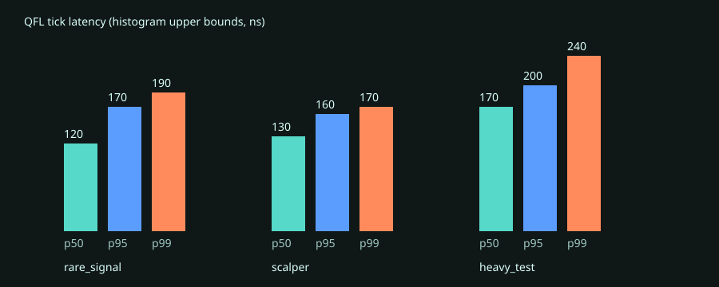
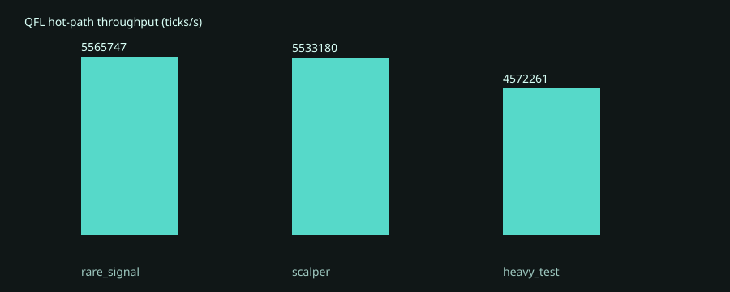

# QFL strategy benchmark matrix

The `strategy_bench` binary provides an apples-to-apples, reproducible VM hot-path matrix. It runs three deliberately different strategies:

- `rare_signal`: branch-heavy, infrequent signal logic;
- `scalper`: EMA + Bollinger-band indicator access;
- `heavy_test`: arithmetic/control-flow-heavy strategy.

## 2026-07-27 baseline

Release build on Linux/x86_64. Total wall time: five minutes, split evenly into 100 seconds per strategy. Every tick includes indicator update, indicator-slot writes, and QFL `on_trade` dispatch. It excludes networking, exchange acknowledgements, disk, and log sinks, so these figures are not an end-to-end trading latency claim.

| Strategy | Throughput | p50 | p95 | p99 | Max observed |
| --- | ---: | ---: | ---: | ---: | ---: |
| rare_signal | 5,565,747 ticks/s | ≤120 ns | ≤170 ns | ≤190 ns | 2.833 ms |
| scalper | 5,533,180 ticks/s | ≤130 ns | ≤160 ns | ≤170 ns | 3.727 ms |
| heavy_test | 4,572,261 ticks/s | ≤170 ns | ≤200 ns | ≤240 ns | 0.410 ms |

Percentiles are upper bounds from a fixed 10 ns histogram. The maximum is intentionally reported but is scheduler/host-noise sensitive; use p99 for comparisons on the same host.





## Reproduce

```bash
cargo run -p quince-engine --bin strategy_bench --release --locked -- \
  --duration-secs 300 \
  --output-dir target/strategy-bench/$(date +%F)
```

The command produces `results.json`, `latency.svg`, and `throughput.svg` in the selected output directory. Keep CPU governor, thermal state, build profile, host, and duration stable when comparing commits.
